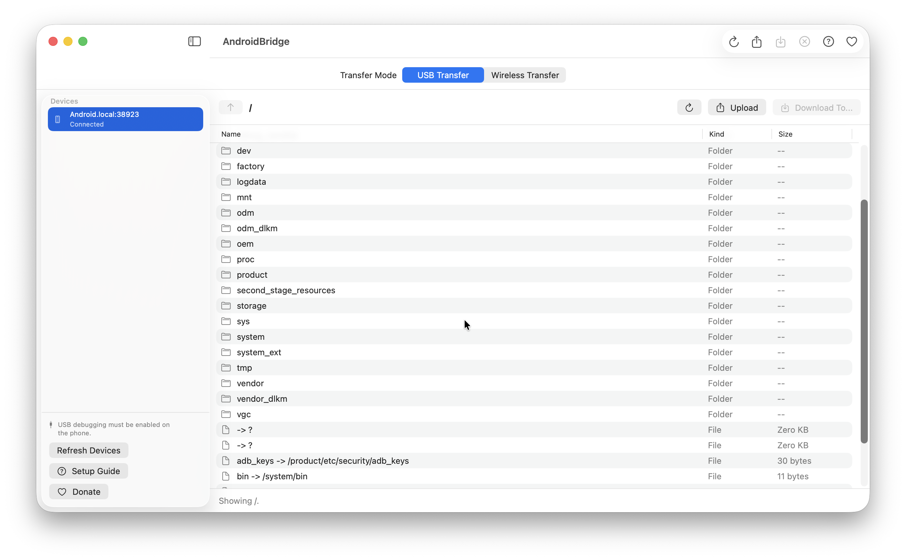

# AndroidBridge


AndroidBridge is a small, free, native macOS app for transferring files between a Mac and an Android phone over USB or Wi-Fi.

It is intentionally simple: connect a phone, browse Android folders, download files to a Mac folder you choose, and upload files or folders back to the current Android folder. Wireless debugging devices use the same full file browser, so the workflow stays the same after pairing over Wi-Fi.



## What's New In 1.2.0

- Adds ADB Wireless pairing, discovery, connect, and disconnect controls
- Reuses the same file browser for USB and wireless debugging devices
- Discovers Android wireless debugging services on the local network
- Keeps upload, download, folder transfer, preview, cancel, progress, and multi-select workflows available over Wi-Fi

## Install

### Homebrew

```bash
brew tap togiwan/tap
brew install --cask androidbridge
```

AndroidBridge also needs Android SDK Platform-Tools:

```bash
brew install android-platform-tools
```

### Manual Download

Download the latest DMG from the [GitHub Releases](https://github.com/togiwan/AndroidBridge/releases/latest) page, open it, and copy `AndroidBridge.app` to Applications.

This free release is ad-hoc signed but not notarized. If macOS blocks the first launch, right-click `AndroidBridge.app` and choose Open.

## Features

- Lists Android devices connected over USB
- Lists Android devices connected over ADB Wireless
- Browses Android folders through ADB
- Pairs and connects Android Wireless debugging devices
- Discovers wireless debugging pairing and connection services on the local network
- Selects one or more Android files or folders at once
- Downloads files and folders to a Mac folder you choose
- Uploads one or more Mac files or folders to the current Android folder
- Cancels active transfers
- Opens Android files through a temporary local preview
- Shows upload/download progress and estimated time for files
- Includes an in-app setup guide for Android Platform-Tools and USB debugging
- Optional donation sheet with copyable wallet address

## Requirements

- macOS 14 or later
- For USB Transfer, Android SDK Platform-Tools, including `adb`
- For USB Transfer, an Android phone with USB debugging enabled
- For USB Transfer, a USB cable that supports data transfer
- For ADB Wireless, Android SDK Platform-Tools, Android Wireless debugging, and a Mac and Android phone on the same local network

## Install ADB

The easiest install path on macOS is Homebrew:

```bash
brew install android-platform-tools
```

You can also download Android SDK Platform-Tools directly from Google:

https://developer.android.com/tools/releases/platform-tools

Verify that ADB sees your phone:

```bash
adb devices
```

If the device says `unauthorized`, unlock the phone and approve the USB debugging RSA prompt.

## Run From Source

```bash
swift run AndroidBridgeCoreTests
swift build
./script/build_and_run.sh
```

To build, package, and verify the app bundle:

```bash
./script/build_and_run.sh --verify
```

The packaged app is created at:

```text
dist/AndroidBridge.app
```

## Install Locally

After building:

```bash
ditto dist/AndroidBridge.app /Applications/AndroidBridge.app
```

Then open AndroidBridge from Finder, Spotlight, or Launchpad.

## Package A Release DMG

```bash
./script/package_dmg.sh
```

The script creates `dist/AndroidBridge.dmg` and prints its SHA256 checksum for Homebrew Cask.

This free release is ad-hoc signed but not notarized. If macOS blocks the first launch, right-click `AndroidBridge.app` and choose Open. If macOS says the app is damaged after downloading from a browser, remove the quarantine attribute:

```bash
xattr -dr com.apple.quarantine /Applications/AndroidBridge.app
```

## Donation

AndroidBridge is free. Donations are optional.

- Asset: USDT
- Network: TRC20
- Address: `TLXKfMgVzX1QYxtU9p5pidoNW2HiKjG6He`

Only send USDT on the TRC20 network to this address.

## License

MIT License. See [LICENSE](LICENSE).

## Keywords

`#AndroidBridge` `#macOS` `#Android` `#ADB` `#USBTransfer` `#FileTransfer` `#SwiftUI`
